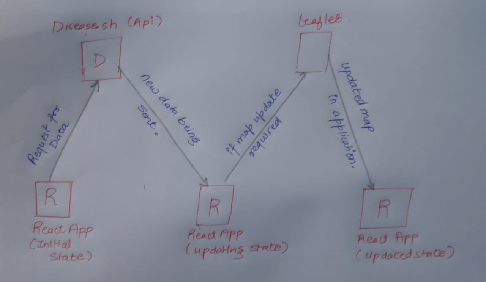
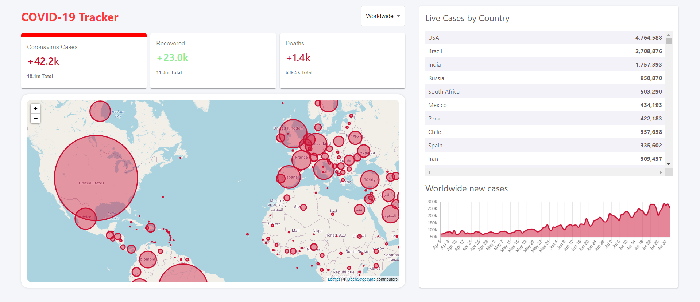
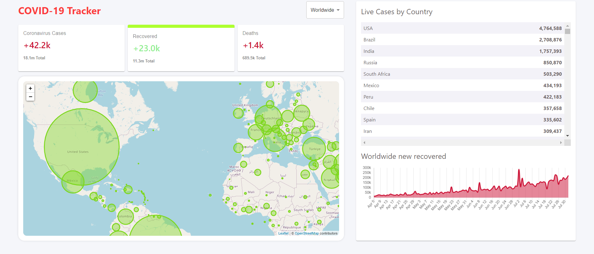
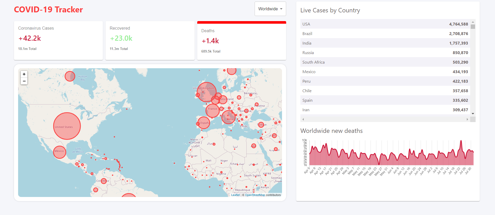
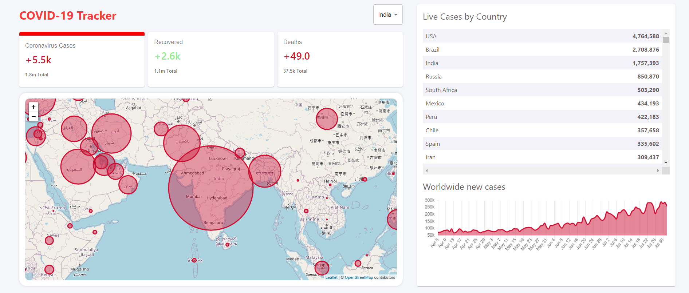
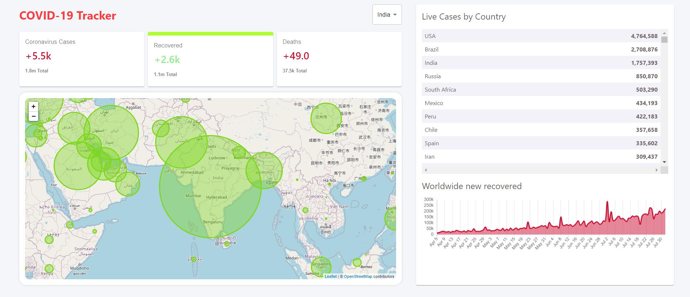
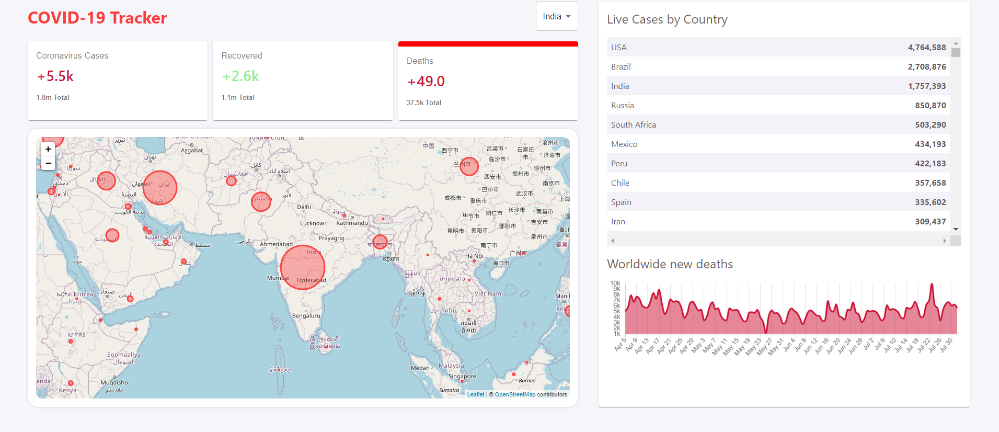

# RealTime-COVID-Tracker
A web application that will be able to show the current status of Covid Cases worldwide.
The number of **total active cases**, **total people recovered** and **total deaths**.

A more statistically representation of the data than just showing the numbers.

> API Used for fetching data **[disease.sh](https://disease.sh/)**

## Technologies & Libraries Used
1. **React Js**
The React is used as a frontend library React makes it painless to create interactive UIs.
Design simple views for each state in your application, and React will efficiently update and render just the right components when your data changes.

2. **Material-UI**
A library of React Components that makes it easier to design and keep out code cleaner.

3. **Chart.js**
A **npm** library for displaying charts, histograms and graphs.

4. **Leaflet**
A library that allows to plugin maps in our websites.

## Workflow of the App

## Data Related to Worldwide

### Total Corona Cases

### Total Recovered Cases

### Total Deaths

## Data Related to particular Country

### Total Corona Cases

### Total Recovered Cases

### Total Deaths

